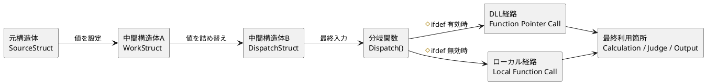
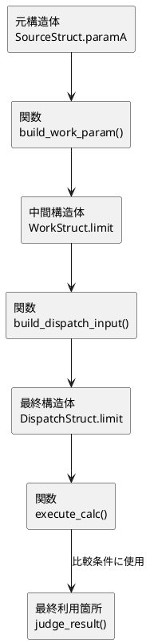
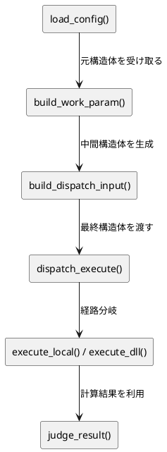
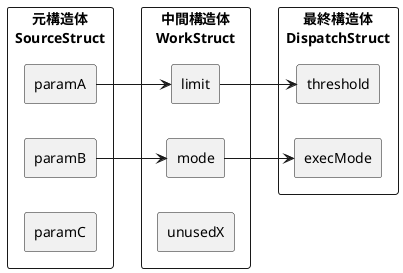
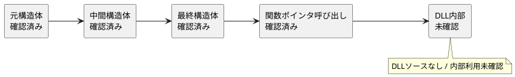

# データフロー調査 PlantUML テンプレート集

## 1. 全体処理フロー図

### 図の名称

全体処理フロー図

### 何を表すか

- 元構造体
- 中間構造体
- 最終構造体
- 関数ポインタ / 条件コンパイル分岐
- DLL / ローカル処理
- 最終利用箇所

### PlantUML テンプレコード



---

## 2. パラメータ影響フロー図

### 図の名称

パラメータ影響フロー図（個別）

### 何を表すか

- 1つのパラメータが
- どのメンバーに移り
- どの関数を通って
- 最終的にどこへ効くか

### PlantUML テンプレコード



---

## 3. 関数経路図

### 図の名称

関数経路図

### 何を表すか

- 値がどの関数を経由して運ばれるか
- 中間構造体よりも「関数の流れ」を見せたいとき用

### PlantUML テンプレコード



---

## 4. 条件コンパイル分岐図

### 図の名称

条件コンパイル分岐図

### 何を表すか

- `#ifdef` によって処理経路がどう変わるか
- DLL 経路とローカル経路の違い

### PlantUML テンプレコード

```plantuml
@startuml
top to bottom direction

rectangle "dispatch_execute()" as D

if "#ifdef USE_DLL" then (true)
  rectangle "関数ポインタ呼び出し\nfp_handler(&input)" as DLLCALL
  rectangle "DLL側処理" as DLLPROC
  D --> DLLCALL
  DLLCALL --> DLLPROC
else (false)
  rectangle "ローカル関数呼び出し\nlocal_handler(&input)" as LOCALCALL
  rectangle "ローカル処理" as LOCALPROC
  D --> LOCALCALL
  LOCALCALL --> LOCALPROC
endif

rectangle "最終計算 / 判定 / 出力" as FINAL
DLLPROC --> FINAL
LOCALPROC --> FINAL

@enduml
```

---

## 5. 構造体変換図

### 図の名称

構造体変換図

### 何を表すか

- 構造体Aのどのメンバーが
- 構造体B/Cのどこへ入るか
- 名前変更が多いときに有効

### PlantUML テンプレコード



---

## 6. 確認状況マップ

### 図の名称

確認状況マップ

### 何を表すか

- どこまで確認済みか
- DLL 内部未確認などを可視化

### PlantUML テンプレコード



---

## どの図を使うべきか

最低限ならこの3つでいい。

1. 全体処理フロー図
2. パラメータ影響フロー図（重要パラメータだけ）
3. 条件コンパイル分岐図

余裕があれば追加。

4. 構造体変換図
5. 確認状況マップ

---

## 使い分け

**全体を見せたい**
- 全体処理フロー図

**このパラメータがどう効くか見せたい**
- パラメータ影響フロー図

**関数を通る流れを見せたい**
- 関数経路図

**`#ifdef` がややこしい**
- 条件コンパイル分岐図

**名前変更が多くてしんどい**
- 構造体変換図

**どこまで確認したか示したい**
- 確認状況マップ
